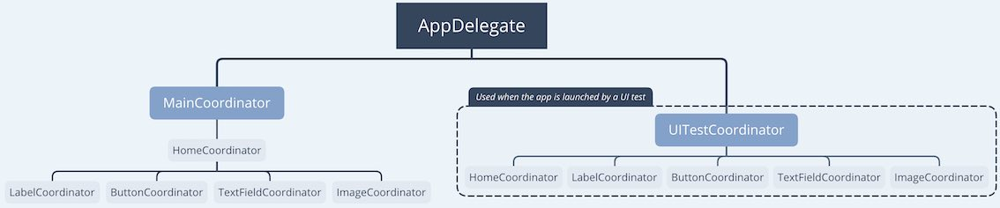

# Advanced Topics

## Table of contents

* [AccessibilityIdentifierProvider (AIP)](#accessibilityIdentifierProvider-(AIP))
* [Launch Arguments](#launch-arguments)
* [Launch specific view](#launch-specific-view)
* [Interaction between Page Objects](#interaction-between-page-objects)
* [Add payload in identifiers](#add-payload-in-identifiers)

## AccessibilityIdentifierProvider (AIP)

### Create a new AIP

In the examples of the README, we use string literals for the accessibility identifier. MSUITest provides a built-in solution to handle the identifiers in a better way.

`AIP` provides an type-safe solution to assign identifiers in our app. Let's create one:

```swift
// 1
import MSUITest

final class HomeAIP: AIP {
    // 2
    static var mainIdentifier: String = "home"
}

extension HomeAIP {
    // 3
    enum Element: String {
        case mainView
        case tableView
    }
}
```

1. Import required framework
2. Each AIP needs a `mainIdentifier` to identify the view container. In this case, it would be the view of a view controller.
3. You need to define a **RawRepresentable (String)** enum called **Element** with a case per element contained in our view container. In this case, we would have a view controller with a plain table view—run the example app to get more context.

**Note:**

I used an AIP per UIViewController in the Example app. I think it's a clean way to organize the identifiers. But, if you think it's overkilling, feel free to use only one AIP for all the UIKit elements of your app.

**Important:**

You must set the file Target Membership to both the app and the UI test bundle. You will see later why we need the visibility of this file even in the UI testing world.


### Assign the accessibility identifier to the UIKit components

Once you have an AIP ready, you can use it to assign the identifier to the UIKit element. MSUITest provides a specific method to do it:

```swift
func addAccessibility<T: AccessibilityIdentifierProvider>(aip: T.Type, element: T.Element)
```

It looks scary but it's actually easy to use:

```swift
class HomeViewController: UIViewController {

    @IBOutlet private var tableView: UITableView!

    override func viewDidLoad() {
        super.viewDidLoad()

        // 1
        view.addAccessibility(aip: HomeAIP.self, element: .mainView)
        tableView.addAccessibility(aip: HomeAIP.self, element: .tableView)
    }
```

1. The first parameter is the AIP which we want to use and the second one is the Element case which we want to assign to the specific UIKit element.

## Launch Arguments

When we launch an UI Tests, we don't have access to our app since it's a separate iOS process. Therefore, we can't communicate directly with it. If we want to inject some information in our app, we can use the launch arguments.

MSUITest has a built-in method to inject arguments:

```swift
XCUIApplication().launchTestMode([
    "myArgument", "1",
    "myArgument2", "hello",
    "myArgument3", "0"
])
```

Then, you can read these arguments in our app with the **UserDefaults**:

```swift
if UserDefaults.standard.string(forKey: "myArgument2") == "hello" {
    print("Found it 😎")
}
```

### Built-in Arguments

MSUITest sets few arguments under the hood.

#### FIRDebugDisabled

This is used by 3rd party libs to disable analytics.

#### Disable Animations

You should always disable the animations of the app when run UI testing to avoid flaky tests. MSUITest provides an argument to use for this purpose: UITestLaunchArgument.animationsDisabled.

Example:

```swift
if UITestLaunchArgument.animationsDisabled.isActive {
    UIView.setAnimationsEnabled(false)
}
```

## Launch specific view

You can save time in your UI tests if you launch a test loading a specific view immediately instead of using the normal app journey. You can achieve it with a proper routing pattern in place. You can see in the example app the following Coordinator flow:



The normal app journey loads the `MainCoordinator` and follows the expected production behaviour. Whereas, when we launch a UI Tests, we can tell the app to load a specific Coordinator:

```swift
extension HomePage {
    func givenPage() -> HomePage {
        XCUIApplication().launchTestMode(customArguments: [
            "-coordinatorUnderUITest", "HomeCoordinator"
        ])

        return self
    }
}
```

and in the **AppDelegate** we can catch the argument:

```swift
if let coordinatorUnderUITest = UserDefaults.standard.string(forKey: "coordinatorUnderUITest") {
    return UITestCoordinator(rootViewController: rootViewController,
                            coordinatorUnderUITest: coordinatorUnderUITest)
}
```

Then, **UITestCoordinator** will load the specific Coordinator:

```swift
final class UITestCoordinator: Coordinator {

    private var coords = [Coordinator]()

    private unowned let rootViewController: UINavigationController
    private let coordinatorUnderUITest: String

    init(rootViewController: UINavigationController, coordinatorUnderUITest: String) {
        self.rootViewController = rootViewController
        self.coordinatorUnderUITest = coordinatorUnderUITest
    }

    func start() {
        let coordinator = createCoordinator()
        coordinator.start()

        coords.append(coordinator)
    }

    private func createCoordinator() -> Coordinator {
        switch coordinatorUnderUITest {
        case HomeCoordinator.identifier:
            return HomeCoordinator(navigationController: rootViewController)
        case LabelCoordinator.identifier:
            return LabelCoordinator(navigationController: rootViewController)
        case ButtonCoordinator.identifier:
            return ButtonCoordinator(navigationController: rootViewController)
        case TextFieldCoordinator.identifier:
            return TextFieldCoordinator(navigationController: rootViewController)
        case ImageCoordinator.identifier:
            return ImageCoordinator(navigationController: rootViewController)
        default:
            fatalError("Coordinator under UI tests not found")
        }
    }
}
```

**Note:**

This approach doesn't scale well and breaks the [Open-Closed principle](https://marcosantadev.com/solid-principles-applied-swift/). I would suggest to use a strategy design pattern for a real app.

## Interaction between Page Objects

There are tests where you would like to interact with other views. A clean approach to do it is to extend your page object with a method which uses other page objects.

Some examples:

```swift
// MARK: - Given
extension HomePage {
    func givenPageFromLoginPage(for user: String) -> HomePage {
        LoginPage()
            .givePage(with user: user)

            .whenTap(element: .loginPage)

        return self
    }
}

// MARK: - When
extension HomePage {
    func whenFocusTextField() -> HomePage {
        TextFieldPage()
            .whenTap(element: .textField)

        return self
    }
}

// MARK: - Should
extension HomePage {
    @discardableResult
    func shouldSeeLabelPage() -> HomePage {

        LabelPage()
            .thenIShouldSee(element: .mainView)

        return self
    }
}
```

and you can use it in a normal chain:

```swift
class HomeTests: XCTestCase {

    func test_whenLogin_seeHome() {

        HomePage()
            .givenPageFromLoginPage(for: "Marco")

            .thenIShouldSee(element: .titleLabel, text: "Welcome")
    }

    func test_whenTapLabelCell_seeLabelView() {
        HomePage()
            .givenPage()

            .whenTapCell(in: .tableView, at: 0)

            .shouldSeeLabelPage()
    }

    func test_whenTapTextFieldCellAndFocusAndBackButton_doNotSeeKeyboard() {
        HomePage()
            .givenPage()

            .whenTapCell(in: .tableView, at: 2)
            .whenFocusTextField()

            .delay(0.2)

            .whenTapBackButton()

            .thenIShouldNotSeeKeyboard()
    }
}
```

## Add payload in identifiers

When we test elements like images driven by API responses, we would like to test also the content of the UIImageView. Unfortunately, we can't get access to these object. A workaround is to add in the identifier a payload with the image information:

**App target**

```swift
final class HomeAIP: AIP {
    static var mainIdentifier: String = "home"
}

extension HomeAIP {
    enum Element: RawRepresentable {
        case mainView
        case imageView(_ imageName: String)

        // We can ignore it for sake of example
        init?(rawValue: String) { return nil }

        var rawValue: String {
            switch self {
            case .mainView:
                return "mainView"
            case .imageView(let name):
                return "imageView_image:\(name)"
            }
        }
    }
}

class HomeViewController: UIViewController {

    @IBOutlet private var imageView: UIImageView!

    // Callback from a API request
    func serverDidAnswer(with imageURL: String) {
        imageView.addAccessibility(aip: ImageAIP., element: .imageView(imageURL))

    }
}
```

**UI Test target**

```swift
final class HomePage {
    typealias Element = HomeAIP.Element
}

extension HomePage: PageObjectUIElementProvider, PageObject {
    func uiElement(for element: Element, in queryProvider: XCUIElementTypeQueryProvider) -> XCUIElement {
        let query = self.query(for: element, in: queryProvider)

        let identifier = HomeAIP.elementIdentifier(for: element)
        return query[identifier]
    }

    private func query(for element: Element, in queryProvider: XCUIElementTypeQueryProvider) -> XCUIElementQuery {
        switch element {
        case .mainView:
            return queryProvider.otherElements
        case .imageView:
            return queryProvider.images
        }
    }
}

class HomeTests: XCTestCase {

    func test_whenLoadView_seeExpectedElements() {
        HomePage()
            .givenPage()

            .thenIShouldSee(element: .imageView("https://google.com/image.png"))
    }
}
```
