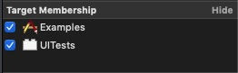

# Advanced Topics

## Table of contents

* [AccessibilityIdentifierProvider (AIP)](#accessibilityIdentifierProvider-(AIP))
* [Launch Arguments](#launch-arguments)
* [AcceLaunch specific view](#launch-specific-view)

## AccessibilityIdentifierProvider (AIP)

In the previous examples, we used string literals for the accessibility identifier. MSUITest provides a built-in solution to handle in better way.

`AIP` provides an type-safe solution to assign identifiers in our app. Let's create one:

```swift
// 1
import MSUITest

final class HomeAIP: AIP {
    // 2
    static var mainIdentifier: String = "home"
}

extension HomeAIP {
    // 3
    enum Element: String {
        case mainView
        case tableView
    }
}
```

1. Remember to import MSUITest
2. Each AIP needs a `mainIdentifier` to identify the view container. In this case, it would be the view of a view controller.
3. We need to define a **rawrepresentable** enum called **Element** with a case per element contained in our view container. In this case, we would have a view controller with a plain table view—run the example app to get more context.

**Note:**

I used an AIP per UIViewController in the Example app. I think it's a clean way to organize the identifier. But, if you think it's overkilling, feel free to use a main AIP for all the UIKit elements of your app.

**Important:**

You must set the file Target Membership to both the app and the UI test bundle. We will see later why we need the visibility of this file even in the UI testing world.



### Assign the accessibility identifier to the UIKit components

Once we have an AIP ready, we can use it to assign the identifier to the UIKit element. MSUITest provides a specific method to do it:

```swift
func addAccessibility<T: AccessibilityIdentifierProvider>(aip: T.Type, element: T.Element
```

It looks scary but it's actually easy to use:

```swift
class HomeViewController: UIViewController {

    @IBOutlet private var tableView: UITableView!

    override func viewDidLoad() {
        super.viewDidLoad()

        // [...]

        addAccessibility()
    }

    private func addAccessibility() {
        // 1
        view.addAccessibility(aip: HomeAIP.self, element: .mainView)
        tableView.addAccessibility(aip: HomeAIP.self, element: .tableView)
    }
```

1. The first parameter is the AIP which we want to use and the second one is the Element case which we want to assing to the specific UIKit element.

## Launch Arguments

## Launch specific view
